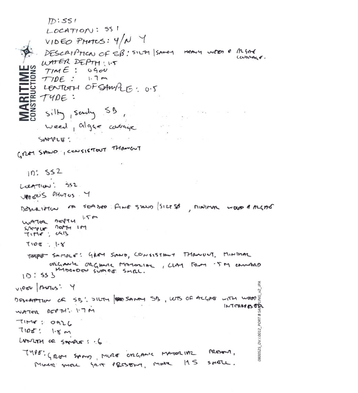
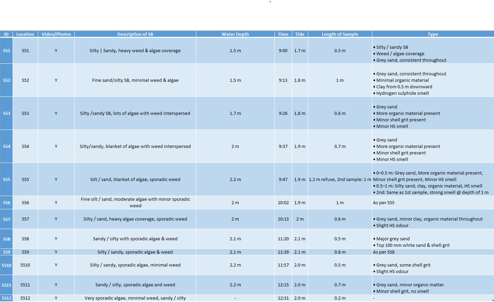
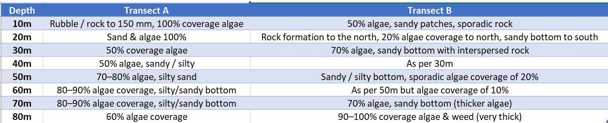

# handwritten-pdf-to-excel
Convert handwritten PDF data into clean, structured Excel sheets for analysis | Data Cleaning | Excel Automation

# 📊 Handwritten PDF to Structured Excel  

This project shows how I convert **handwritten or scanned PDF files** into clean, structured Excel sheets that are ready for analysis.  

---

## 📝 Problem  
Businesses, researchers, and professionals often deal with handwritten or scanned documents.  
These are hard to analyze, sort, or visualize directly.  

---

## ✅ Solution  
- Extracted handwritten entries from PDF  
- Cleaned & formatted into **Excel tables**  
- Ensured **accuracy, consistency, and ready-to-use data**  

---

## 📂 Project Files  
- 📄 [Sample Handwritten PDF](sample_input.pdf)  
- 📊 [Final Structured Excel Output](structured_output.xlsx)  

---

## 📸 Before & After  

**Handwritten Input:**  
  

**Excel Output:**  
  
  

---

## ⚙️ Tools Used  
- Python (Pandas, OpenPyXL)  
- Microsoft Excel  

---

## 💼 Services I Offer  
- PDF / Handwritten → Excel or CSV  
- Data Cleaning & Formatting  
- Excel Dashboards & Analysis  

---

## 📩 Contact  
📧 Email: pushpalkawara101@gmail.com  
